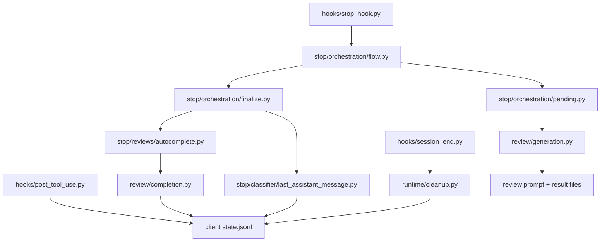
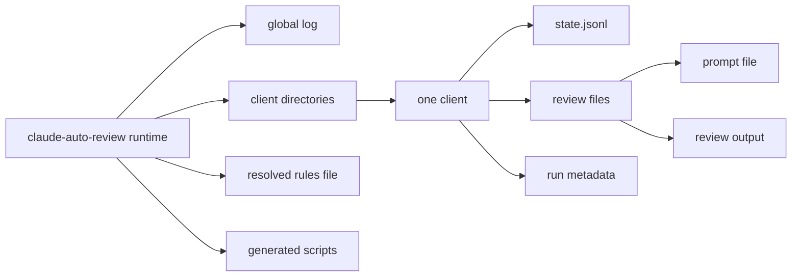

# Development Notes

This repository contains a Claude Code plugin. Keep this file focused on how the pieces fit together.

## System Graph

## Entry Points

- `hooks/post_tool_use.py` records every edited file as an append-only state event.
- `hooks/stop_hook.py` decides whether Claude may stop, then routes into the stop orchestration flow.
- `hooks/session_end.py` removes the active client session data and prunes stale pending reviews.

## Core Subsystems

### State

- `claude_auto_review/state/models.py` defines the record shapes written to JSONL.
- `claude_auto_review/state/store_read.py` loads and filters client state.
- `claude_auto_review/state/store_write.py` appends events and computes file hashes.
- `claude_auto_review/state/reviews.py` answers whether a file-version is reviewed.
- `claude_auto_review/state/review_matching.py` matches pending reviews to file entries.
- `claude_auto_review/state/review_expiry.py` handles review timeout logic.
- `claude_auto_review/state/hook_input.py` parses hook payloads.

### Runtime

- `claude_auto_review/runtime/setup.py` creates the per-client runtime tree under `.claude/claude-auto-review/`.
- `claude_auto_review/runtime/cleanup.py` removes per-client data and expired pending reviews.
- `claude_auto_review/runtime/helpers.py` centralizes structured event logging.
- `claude_auto_review/runtime/pending_cleanup.py` handles pending review cleanup.

### Review Generation

- `claude_auto_review/review/generation.py` builds the prompt from git diff, file snapshots, and project rules.
- `claude_auto_review/review/prompt_flow.py` writes the prompt and review files.
- `claude_auto_review/review/prompt.py` is the subprocess entry point for running a review prompt.
- `claude_auto_review/review/prompt_templates.py` contains the prompt template strings.
- `claude_auto_review/review/rendering.py` formats file content for review prompts.
- `claude_auto_review/review/completion.py` reads review output and marks covered file hashes reviewed.

### Stop Flow

- `claude_auto_review/stop/orchestration/flow.py` coordinates the stop decision.
- `claude_auto_review/stop/orchestration/pending.py` resolves an existing pending review or creates a new one.
- `claude_auto_review/stop/orchestration/finalize.py` applies the review result, handles autocomplete, and finalizes the stop decision.
- `claude_auto_review/stop/orchestration/context.py` manages stop context.
- `claude_auto_review/stop/orchestration/resolution.py` defines resolution types.
- `claude_auto_review/stop/orchestration/response_actions.py` defines allow/block actions.
- `claude_auto_review/stop/reviews/selection.py` chooses which files still need review.
- `claude_auto_review/stop/reviews/autocomplete.py` runs the Claude CLI reviewer when available.
- `claude_auto_review/stop/reviews/prompt_runner.py` resolves the review prompt runner path.
- `claude_auto_review/stop/feedback.py` formats the blocking message shown back to Claude.
- `claude_auto_review/stop/response.py` emits the JSON stop/block response.

### Classifier

- `claude_auto_review/stop/classifier/last_assistant_message.py` optionally classifies the last assistant message on blocked stop attempts.
- `claude_auto_review/stop/classifier/extraction.py` extracts the message text from the hook payload.
- `claude_auto_review/stop/classifier/client.py` talks to the Anthropic API.
- `claude_auto_review/stop/classifier/models.py` defines classifier defaults and result objects.
- `claude_auto_review/stop/classifier/request.py` builds classifier API requests.
- `claude_auto_review/stop/classifier/response.py` parses classifier API responses.

### Paths & Utilities

- `claude_auto_review/paths/path_utils.py` defines shared path constants and helpers.
- `claude_auto_review/paths/uri_utils.py` normalizes file URIs to relative paths.
- `claude_auto_review/runtime/client_dirs.py` manages per-client runtime directories.
- `claude_auto_review/config/settings.py` loads plugin settings and resolves rules paths.
- `claude_auto_review/utils/shell_parsing.py` tokenizes shell commands for edit tracking.
- `claude_auto_review/utils/datetime_utils.py` provides ISO timestamp parsing and age helpers.

### Install

- `claude_auto_review/install/installer.py` installs runtime files and updates project settings.
- `claude_auto_review/install/shims.py` generates the runtime wrapper scripts.
- `claude_auto_review/install/setup_cli.py` and `claude_auto_review/install/cancel_cli.py` are the CLI entry points.

### Support Files

- `agents/reviewer.md` defines the review agent used by autocomplete.
- `rules/review-rules.md` is the default project rules file copied during setup.
- `.claude-plugin/plugin.json` declares hooks, commands, agents, and default plugin settings.

## Settings

`claude-auto-review` lives in `.claude/settings.json`.

| Key | Default | Meaning |
|-----|---------|---------|
| `enabled` | `true` | Enable or disable the plugin |
| `rulesFile` | `.claude/claude-auto-review/review-rules.md` | Path to the review rules file |
| `includeExtensions` | `[]` | Only track these suffixes when set |
| `skipExtensions` | `[]` | Never track these suffixes |
| `maxStopPasses` | `3` | Stop-block circuit breaker threshold |
| `pendingReviewTimeoutHours` | `1` | Age before a pending review expires |
| `reviewerTimeoutSeconds` | `600` | Hard cap for the review subprocess |
| `reviewFeedbackMaxChars` | `9000` | Maximum feedback copied back into Claude |
| `lastAssistantMessageClassifierEnabled` | `true` | Enable the blocked-stop classifier |
| `lastAssistantMessageClassifierTimeoutSeconds` | `20` | Timeout for the classifier API call |
| `staleClientTimeoutHours` | `48` | Hours after which a client session is considered stale |

## Runtime Layout

## Review Process

1. The post-tool hook appends file edits to the active client's state.
2. The stop hook finds unreviewed hashes for that client.
3. If needed, the review generator writes a prompt file and a pending-review record.
4. The reviewer subprocess or Claude CLI autocomplete writes the review result.
5. Finalization marks covered hashes reviewed and decides whether Claude may stop.
6. The optional classifier records message-level telemetry for blocked stops (log-only sidecar).

## Testing Shape

- **Unit** tests cover individual modules and helpers.
- **Integration** tests cover state, runtime, and orchestration working together.
- **E2E** tests exercise the hook entry points through subprocesses.

Prefer concrete assertions around stop decisions, state transitions, and review coverage rather than broad snapshot-style checks.
