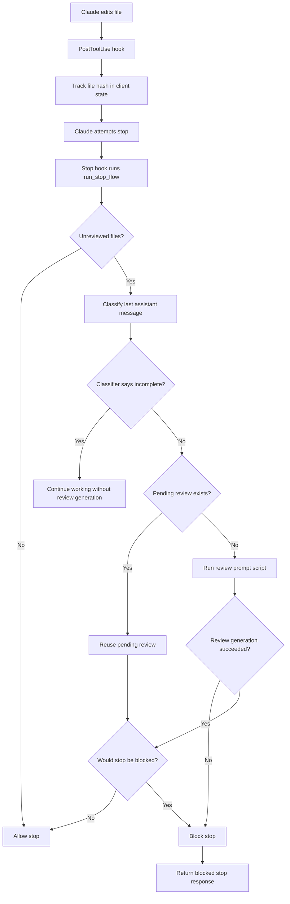

[](tests/)
[](https://pypi.org/project/claude-auto-review/)

# Claude Auto Review

Claude Code plugin for automatic review after Claude edits files.

After each file edit (Write/Edit/MultiEdit/Delete), the plugin tracks the file hash. When Claude tries to stop, the plugin blocks until the changes have been reviewed — either manually in-session or automatically via a reviewer CLI backend.

## Features

- Tracks file edits through Claude Code hooks and blocks stop until changes are reviewed.
- Supports reviewer CLI backends via `reviewerBackend` (`claude` or `codex`).
- Uses a last-message classifier to skip review generation when Claude should keep working.
- Enforces a stop circuit breaker with `maxStopPasses`.
- Live-reloads `.claude/settings.json` without a restart.

## Architecture

The implementation is split into small modules instead of one monolith:



The classifier now runs before pending-review resolution on unreviewed stop paths: `incomplete` lets Claude continue working without invoking review generation, while `complete`, `unknown`, `error`, and `skipped` continue into the normal review/block flow.

The stop flow reads the current client state into a snapshot once per stop attempt so lifecycle queries share one view of the session.

State events are written through a single semantic append path so the per-client `state.jsonl` log and the project-level lifecycle log stay aligned.

## Related Projects

This plugin was inspired by:

- [hamelsmu/claude-review-loop](https://github.com/hamelsmu/claude-review-loop) — a stop-hook-driven automated review loop that uses Claude Code lifecycle hooks to block stops until diffs are reviewed.
- [NTCoding/claude-skillz/automatic-code-review](https://github.com/NTCoding/claude-skillz/tree/main/automatic-code-review) — an automatic code review workflow built around session hooks, review rules, and tracked file changes.

Thanks to both projects for the ideas and patterns that influenced this plugin.

## Installation

See [INSTALL.md](INSTALL.md) for full details.

```bash
# Install from PyPI
pip install claude-auto-review

# One-time init in your target project root
claude-auto-review install
# or: car install
```

The installer creates the local `.claude/claude-auto-review/` runtime tree (with `scripts/`, `agents/`, `clients/` subdirs; `clients/*/reviews/` and `clients/*/run/` created lazily per session), copies the default rules, configures `.claude/settings.json`, and updates `.gitignore`.

`car` is a shorter alias for `claude-auto-review`, so the same install and management commands can be run as `car install`, `car cancel`, `car prompt`, and `car uninstall`.

After installation, future Claude Code sessions will **work with claude-auto-review automatically**.

## Implementation

- Dependency-free Python (standard library only)
- Uses Claude Code PostToolUse, Stop, and SessionEnd hooks
- Client isolation per session via `CLAUDE_SESSION_ID`
- Circuit breaker after `maxStopPasses` blocks (default: 5)
- Auto-completion via Claude or Codex CLI reviewer backend when available
- Reviewer hard-cap via `reviewerTimeoutSeconds` (default: 600 seconds)
- Reviewer backend selection via `reviewerBackend` (`claude` or `codex`) with backend-specific default reviewer models
- Settings are [live-reloaded from `.claude/settings.json`](CLAUDE.md#settings) — no restart needed
