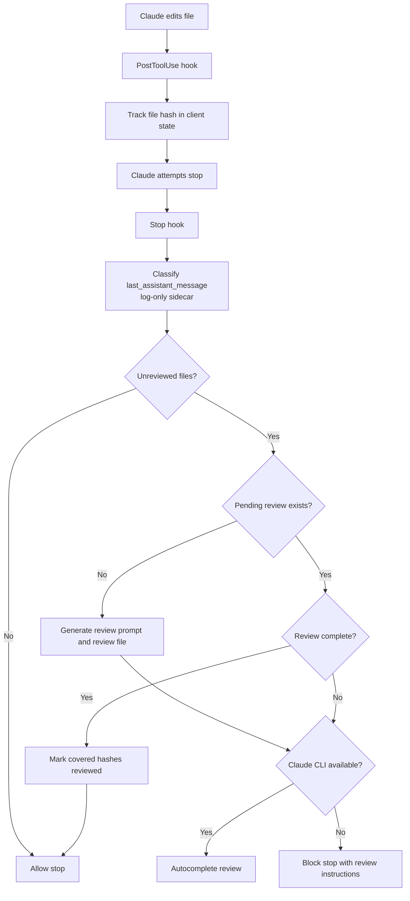

# Claude Auto Review

Claude Code plugin for automatic review after Claude edits files.

## Overview

After each file edit (Write/Edit/MultiEdit/Delete), the plugin tracks the file hash. When Claude tries to stop, the plugin blocks until the changes have been reviewed — either manually in-session or automatically via Claude CLI sub-agent.

## Architecture

The implementation is split into small modules instead of one monolith:



- `hooks/post_tool_use.py`, `hooks/stop_hook.py`, `hooks/session_end.py` are thin entrypoints.
- `claude_auto_review/paths.py`, `claude_auto_review/settings.py`, `claude_auto_review/bootstrap.py` cover paths, config, and bootstrapping.
- `claude_auto_review/state/store_read.py`, `claude_auto_review/state/store_write.py`, `claude_auto_review/state/reviews.py` cover state bookkeeping.
- `claude_auto_review/runtime/helpers.py`, `claude_auto_review/runtime/setup.py`, `claude_auto_review/runtime/cleanup.py` cover runtime lifecycle.
- `claude_auto_review/review/generation.py`, `claude_auto_review/review/prompt_flow.py`, `claude_auto_review/review/prompt.py`, `claude_auto_review/review/completion.py` cover review generation and completion.
- `claude_auto_review/stop/orchestration/flow.py`, `claude_auto_review/stop/orchestration/pending.py`, `claude_auto_review/stop/orchestration/finalize.py`, `claude_auto_review/stop/reviews/selection.py`, `claude_auto_review/stop/reviews/autocomplete.py` cover stop-hook orchestration.
- `claude_auto_review/install/installer.py`, `claude_auto_review/install/shims.py`, `claude_auto_review/install/setup_cli.py`, `claude_auto_review/install/cancel_cli.py` cover installation.

**Commands:**
- `/claude-auto-review` — Run manual review for current unreviewed files
- `/cancel-claude-auto-review` — Cancel all runtime state for this project

## Installation

See [INSTALL.md](INSTALL.md) for the full installation guide.

Quick install from a target project:

```bash
python path/to/claude-auto-review/claude_auto_review/install/setup_cli.py
```

The installer creates the local `.claude/claude-auto-review/` runtime tree, copies the default rules, configures `.claude/settings.json`, and updates `.gitignore`.

## Quick Start

```bash
# Run tests
python -m unittest discover -s tests
```

## Implementation

- Dependency-free Python (standard library only)
- Uses Claude Code PostToolUse, Stop, and SessionEnd hooks
- Client isolation per session via `CLAUDE_SESSION_ID`
- Circuit breaker after `maxStopPasses` blocks (default: 3)
- Auto-completion via Claude CLI sub-agent when available
- Reviewer hard-cap via `reviewerTimeoutSeconds` (default: 600 seconds)
