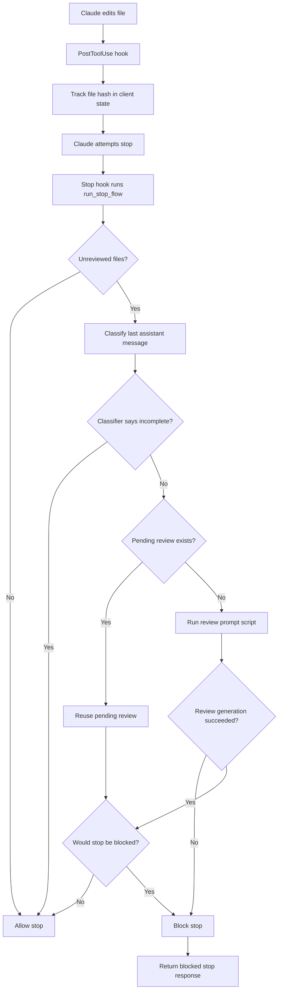

# Claude Auto Review

Claude Code plugin for automatic review after Claude edits files.

After each file edit (Write/Edit/MultiEdit/Delete), the plugin tracks the file hash. When Claude tries to stop, the plugin blocks until the changes have been reviewed — either manually in-session or automatically via Claude CLI sub-agent.

## Architecture

The implementation is split into small modules instead of one monolith:



- **Hook entrypoints:** `hooks/post_tool_use.py`, `hooks/stop_hook.py`, `hooks/session_end.py`
- **Core config:** `config/constants.py`, `config/settings.py`, `paths/path_utils.py`, `paths/uri_utils.py`, `runtime/client_dirs.py`, `utils/bootstrap.py`
- **State bookkeeping:** `state/models.py`, `state/snapshot.py`, `state/store/read.py`, `state/store/write.py`, `state/store/rewrite.py`, `state/reviews/matching.py`, `state/reviews/expiry.py`, `state/hook_input.py`
- **Review generation:** `review/prompting/generation.py`, `review/prompting/flow.py`, `review/prompt.py`, `review/prompting/templates.py`, `review/completion.py`, `review/prompting/rendering.py`
- **Stop orchestration:** `stop/orchestration/core/flow.py`, `stop/orchestration/core/pending.py`, `stop/orchestration/core/finalize.py`, `stop/orchestration/core/context.py`, `stop/orchestration/core/resolution.py`, `stop/orchestration/core/response_actions.py`
- **Stop response:** `stop/feedback.py`, `stop/response.py`
- **Selection & autocomplete:** `stop/reviews/core/selection.py`, `stop/reviews/core/autocomplete.py`, `stop/reviews/core/prompt_runner.py`
- **Classifier:** `stop/classifier/core/last_assistant_message.py`, `stop/classifier/core/extraction.py`, `stop/classifier/core/client.py`, `stop/classifier/core/models.py`, `stop/classifier/core/request.py`, `stop/classifier/core/response.py`
- **Runtime:** `runtime/setup.py`, `runtime/cleanup/`, `runtime/context.py`, `runtime/hook_context.py`, `runtime/events.py`, `runtime/process.py`, `runtime/pending_cleanup.py`
- **Utilities:** `utils/shell_parsing.py`, `utils/datetime_utils.py`
- **Install:** `install/installer.py`, `install/shims.py`, `install/setup_cli.py`, `install/cancel_cli.py`
- **Support files:** `agents/reviewer.md`, `rules/review-rules.md`

The classifier now runs before pending-review resolution on unreviewed stop paths: `incomplete` lets Claude continue working without invoking review generation, while `complete`, `unknown`, `error`, and `skipped` continue into the normal review/block flow.

**Commands:**
- `/claude-auto-review` — Complete manual review for current unreviewed files
- `/cancel-claude-auto-review` — Cancel all runtime state for the current session

## Installation

See [INSTALL.md](INSTALL.md) for full details.

```bash
# From this repo (pip editable install + one-time init):
pip install -e .
claude-auto-review install
```

The installer creates the local `.claude/claude-auto-review/` runtime tree (with `scripts/`, `agents/`, `clients/` subdirs; `clients/*/reviews/` and `clients/*/run/` created lazily per session), copies the default rules, configures `.claude/settings.json`, and updates `.gitignore`.

## Quick Start

```bash
# Run tests
python -m unittest discover -s tests
```

## Implementation

- Dependency-free Python (standard library only)
- Uses Claude Code PostToolUse, Stop, and SessionEnd hooks
- Client isolation per session via `CLAUDE_SESSION_ID`
- Circuit breaker after `maxStopPasses` blocks (default: 5)
- Auto-completion via Claude CLI sub-agent when available
- Reviewer hard-cap via `reviewerTimeoutSeconds` (default: 600 seconds)
