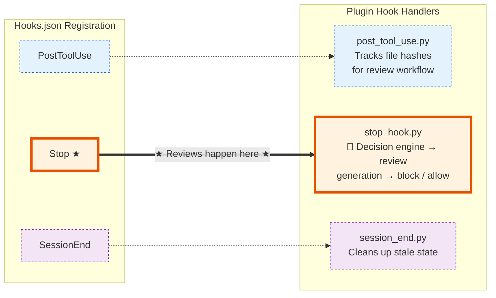
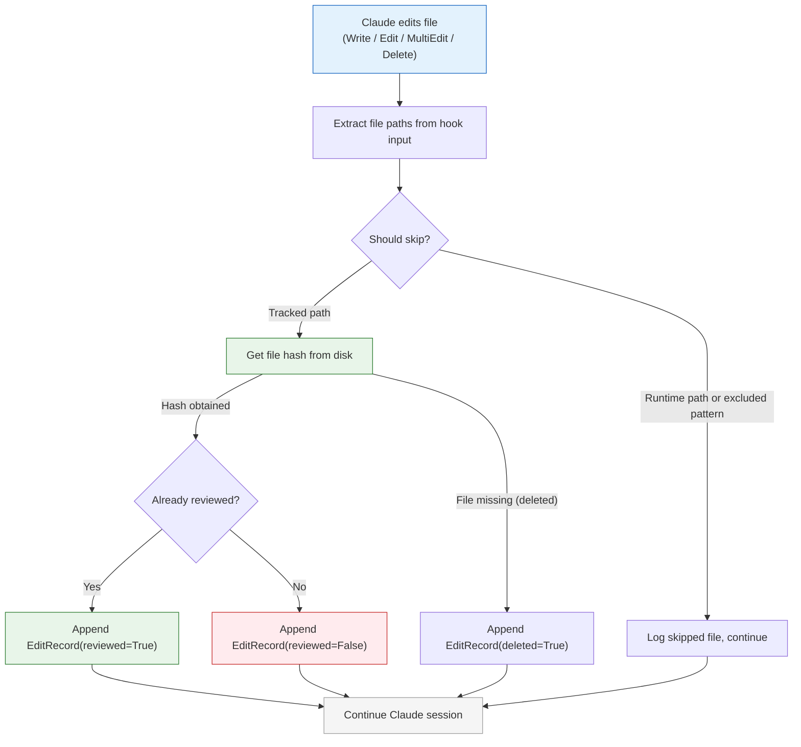
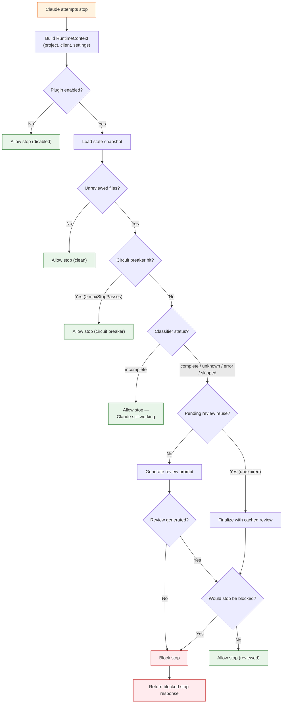
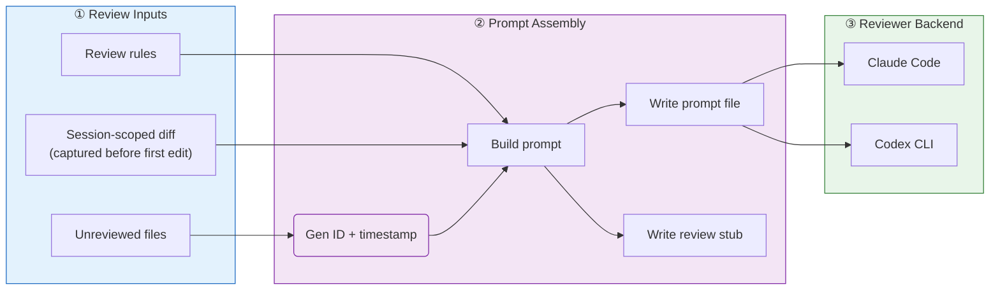
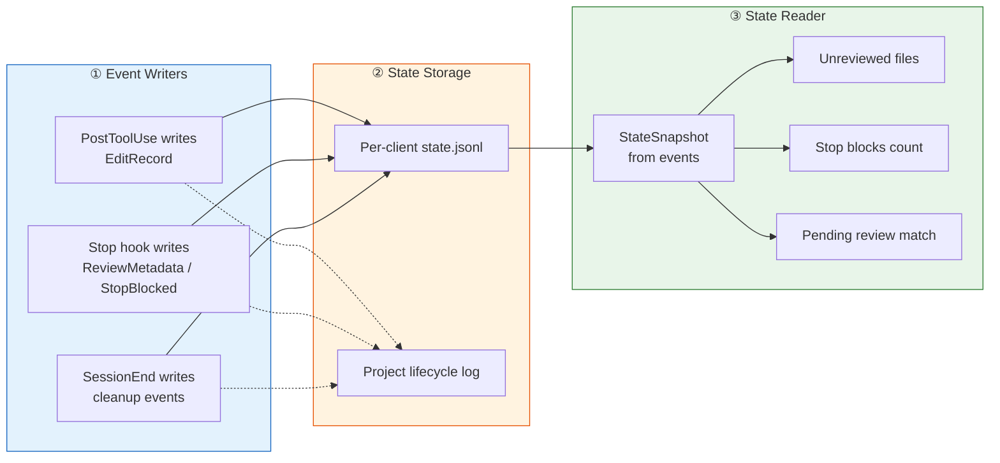

[](tests/)
[](https://pypi.org/project/claude-auto-review/)

# Claude Auto Review

Claude Code plugin for automatic review after Claude edits files.

After each file edit (Write/Edit/MultiEdit/Delete), the plugin tracks the file hash. When Claude tries to stop, the plugin blocks until the changes have been reviewed — either manually in-session or automatically via a reviewer CLI backend.

## Features

- Tracks file edits through Claude Code hooks and blocks stop until changes are reviewed.
- Supports reviewer CLI backends via `reviewerBackend` (`claude`, `codex`, or `opencode`).
- Uses a last-message classifier to skip review generation when Claude should keep working.
- Enforces a stop circuit breaker with `maxStopPasses`.
- Live-reloads `.claude/settings.json` without a restart.
- Dependency-free Python (standard library only).
- Works inside git worktrees — resolves to the main repo's `.claude/claude-auto-review/` state via `git rev-parse --show-toplevel`.

## Installation

```bash
pip install claude-auto-review          # Install from PyPI
claude-auto-review install              # One-time init in project root
# or: car install
```

Creates `.claude/claude-auto-review/`, copies rules, and updates `.claude/settings.json`.

Then configure:

```bash
claude-auto-review config               # Interactive setup wizard
# or: car config
```

Prompts for the key settings — after that, Claude Code sessions **use the plugin automatically**.

See [INSTALL.md](INSTALL.md) for full details.

## Architecture

The implementation is split into small modules instead of one monolith. Below are focused diagrams covering each subsystem.

---

### 1. Hook Wiring

Claude Code calls three lifecycle hooks, each mapped to a plugin hook handler via `hooks.json`:



---

### 2. File Edit Tracking (PostToolUse)

Every time Claude edits a file, the PostToolUse hook captures the file hash and stores an event for later review:



---

### 3. Stop Flow — Decision Engine

When Claude attempts to stop, the Stop hook runs the stop-flow service through staged checks. Each stage decides whether to allow the stop, continue without review, or block for review:



---

### 4. Review Prompt Generation

When a new review is needed, the plugin assembles context from rules and session-scoped diffs into a prompt for the reviewer backend:



---

### 5. State Management

All session events are recorded as JSONL entries. A snapshot is computed on each stop attempt for consistent queries:




---

The classifier runs before pending-review resolution on unreviewed stop paths: `incomplete` lets Claude continue working without invoking review generation, while `complete`, `unknown`, `error`, and `skipped` continue into the normal review/block flow.

The stop flow reads the current client state into a snapshot once per stop attempt so lifecycle queries share one view of the session.

State events are written through a single semantic append path so the per-client `state.jsonl` log and the project-level lifecycle log stay aligned.

## Related Projects

This plugin was inspired by:

- [hamelsmu/claude-review-loop](https://github.com/hamelsmu/claude-review-loop) — a stop-hook-driven automated review loop that uses Claude Code lifecycle hooks to block stops until diffs are reviewed.
- [NTCoding/claude-skillz/automatic-code-review](https://github.com/NTCoding/claude-skillz/tree/main/automatic-code-review) — an automatic code review workflow built around session hooks, review rules, and tracked file changes.

Thanks to both projects for the ideas and patterns that influenced this plugin.


